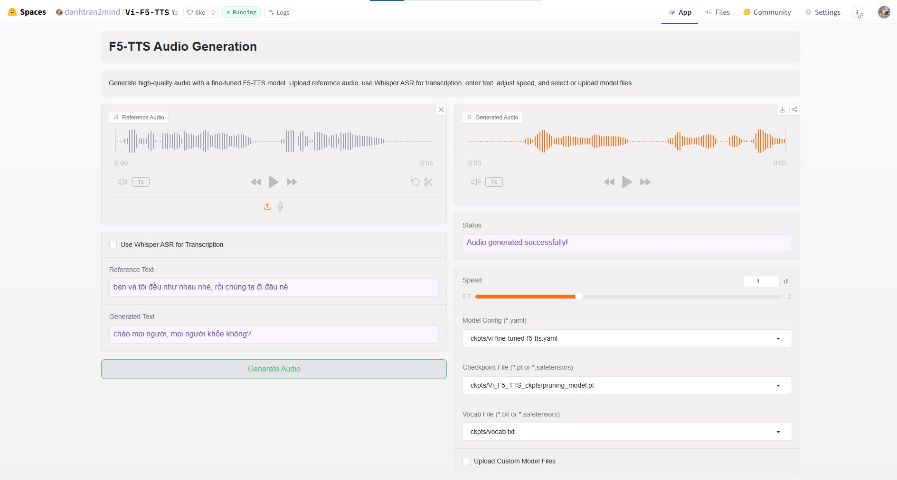

# Vietnamese F5-TTS🗣️ (Vi-F5-TTS)

[](https://github.com/danhtran2mind/Vi-F5-TTS/stargazers)


[](https://huggingface.co/docs/hub)
[](https://huggingface.co/docs/accelerate)
[](https://github.com/TimDettmers/bitsandbytes)
[](https://pytorch.org/)
[](https://huggingface.co/docs/transformers)
[](https://huggingface.co/docs/diffusers)
[](https://gradio.app/)

[](https://opensource.org/licenses/MIT)


## Introduction

Vietnamese F5-TTS (Vi-F5-TTS) is a fine-tuned text-to-speech model for Vietnamese, based on F5-TTS. Using the vin100h-preprocessed-v2 dataset, it generates natural Vietnamese audio 🎙️ for applications like voice assistants 🤖 and audiobooks 📚, powered by PyTorch, Transformers, and Gradio 🚀.

## Key Features

- **Vietnamese Speech** 🎤: Produces natural Vietnamese audio from text.
    
- **Fine-Tuned** 🔧: Optimized for better pronunciation and intonation.
    
- **Customizable Inference** 🎛️: Uses reference audio/text for tailored output.
    
- **Gradio GUI** 🖥️: Interactive interface for easy testing.
    
- **Open-Source** 🌐: MIT-licensed with accessible code and checkpoints.
    
- **Multi-Platform** ☁️: Supports Colab, Kaggle, SageMaker, and local use.
    
- **Flexible Training** ⚙️: Configurable with accelerate support.

## Notebook

[](https://colab.research.google.com/github/danhtran2mind/Vi-F5-TTS/blob/main/notebooks/vi-fine-tuned-t5-tts.ipynb)
[](https://studiolab.sagemaker.aws/import/github/danhtran2mind/Vi-F5-TTS/blob/main/notebooks/vi-fine-tuned-t5-tts.ipynb)
[](https://deepnote.com/launch?url=https://github.com/danhtran2mind/Vi-F5-TTS/blob/main/notebooks/vi-fine-tuned-t5-tts.ipynb)
[](https://mybinder.org/v2/gh/danhtran2mind/Vi-F5-TTS/main?filepath=notebooks/vi-fine-tuned-t5-tts.ipynb)
[](https://console.paperspace.com/github/danhtran2mind/Vi-F5-TTS/blob/main/notebooks/vi-fine-tuned-t5-tts.ipynb)
[](https://mybinder.org/v2/gh/danhtran2mind/Vi-F5-TTS/main)
[](https://www.kaggle.com/notebooks/welcome?src=https%3A%2F%2Fgithub.com%2Fdanhtran2mind%2FVi-F5-TTS/blob/main/notebooks/vi-fine-tuned-t5-tts.ipynb)
[](https://github.com/danhtran2mind/Vi-F5-TTS/blob/main/notebooks/vi-fine-tuned-t5-tts.ipynb)

## Dataset
You can explore more in this HuggingFace Dataset available at the given link for further details: [](https://huggingface.co/datasets/htdung167/vin100h-preprocessed-v2).

## Demonstration
Experience the magic of Vietnames Text to Speech from:  
- **HuggingFace Space**: [](https://huggingface.co/spaces/danhtran2mind/Vi-F5-TTS)

- **Demo GUI**:  
  

To run the Gradio app locally (`localhost:7860`):  
```bash
python apps/gradio_app.py
```


## Usage Guide
### Setup Instructions
#### Step 1: Clone the Repository
Clone the project repository and navigate to the project directory:
```bash
git clone https://github.com/danhtran2mind/Vi-F5-TTS.git
cd Vi-F5-TTS
```

#### Step 2: Install Dependencies
Install the required Python packages:
```bash
pip install -e . 
```
Or Install Dependencies using `requirements.txt`
```bash
pip install -r requirements/requirements.txt
```

#### Step 3: Configure the Environment
Run the following scripts to set up the project:
- **Install Third-Party Dependencies**  
  ```bash
  python scripts/setup_third_party.py
  ```
- **Download Model Checkpoints**
    - Use `SWivid/F5-TTS`:
    ```bash
    python scripts/download_ckpts.py \
        --repo_id "SWivid/F5-TTS" --local_dir "./ckpts" \
        --folder_name "F5TTS_v1_Base_no_zero_init"
    ```
    - Use `danhtran2mind/Vi-F5-TTS`:
    ```bash
    python scripts/download_ckpts.py \
        --repo_id "danhtran2mind/Vi-F5-TTS" \
        --local_dir "./ckpts" --pruning_model
    ```

- **Prepare Dataset (Optional, for Training)**  
  ```bash
  python scripts/process_dataset.py
  ```

### Training
#### Config
Configuration of the `accelerate`
```bash
accelerate config default
```
#### Training Bash
To train the model:
```bash
accelerate launch ./src/f5_tts/train/finetune_cli.py \
    --exp_name F5TTS_Base \
    --dataset_name vin100h-preprocessed-v2 \
    --finetune \
    --tokenizer pinyin \
    --learning_rate 1e-05 \
    --batch_size_type frame \
    --batch_size_per_gpu 3200 \
    --max_samples 64 \
    --grad_accumulation_steps 2 \
    --max_grad_norm 1 \
    --epochs 80 \
    --num_warmup_updates 2761 \
    --save_per_updates 4000 \
    --keep_last_n_checkpoints 1 \
    --last_per_updates 4000 \
    --log_samples \
    --pretrain "<your_pretrain_model>"# such as "./ckpts/F5TTS_v1_Base_no_zero_init/model_1250000.safetensors"
```
#### Training Arguments
Refer to the [Training Documents](docs/training/training_doc.md) for detailed arguments used in fine-tuning the model. ⚙️

### Inference
#### Inference Bash
To generate videos using the trained model:
```bash
python src/f5_tts/infer/infer_cli.py \
    --model_cfg "vi-fine-tuned-f5-tts.yaml" \
    --ckpt_file "model_last.pt" \
    --vocab_file "vocab.txt" \
    --ref_audio "<path_to_your_reference_audio>" \
    --ref_text "<text_of_your_reference_audio>" \
    --gen_text "<your_generative_text>" \
    --output_dir "<output_folder>" \
    --output_file "<output_file_name>"
```
#### Inference Arguments
Refer to the [Inference Documents](docs/inference/inference_doc.md) for detailed arguments used in Inference. ⚙️
#### Inference Example
|Reference Text|Reference Audio|Inference Text|Inference Audio|
|:-------:|:-------:|:-------:|:-------:|
|bạn và tôi đều như nhau nhé, rồi chúng ta đi đâu nè|<audio controls style="width: 150px;"><source src="https://raw.githubusercontent.com/danhtran2mind/Vi-F5-TTS/main/assets/examples/f5_tts/1/refer_audio.mp3" type="audio/mpeg"></audio>|chào mọi người, mọi người khỏe không?|<audio controls style="width: 150px;"><source src="https://raw.githubusercontent.com/danhtran2mind/Vi-F5-TTS/main/assets/examples/f5_tts/1/infer_audio.wav" type="audio/wav"></audio>|
|Chúng thường sống hòa bình với các loài động vật khác, kể cả những loài săn mồi.|<audio controls style="width: 150px;"><source src="https://raw.githubusercontent.com/danhtran2mind/Vi-F5-TTS/main/assets/examples/f5_tts/2/refer_audio.mp3" type="audio/wav"></audio>|Tôi rất khỏe,cảm ơn mọi người đã quan tâm.|<audio controls style="width: 150px;"><source src="https://raw.githubusercontent.com/danhtran2mind/Vi-F5-TTS/main/assets/examples/f5_tts/2/infer_audio.mp3" type="audio/wav"></audio>|
|Sau nhà Ngô, lần lượt các triều Đinh, Tiền Lê, Lý và Trần tổ chức chính quyền tương tự các triều đại Trung Hoa, lấy Phật giáo làm tôn giáo chính của quốc gia và cho truyền bá cả Nho giáo và Đạo giáo.|<audio controls style="width: 150px;"><source src="https://raw.githubusercontent.com/danhtran2mind/Vi-F5-TTS/main/assets/examples/f5_tts/3/refer_audio.mp3" type="audio/wav"></audio>|Nhà Tiền Lê, Lý và Trần đã chống trả các cuộc tấn công của nhà Tống và nhà Mông – Nguyên, đều thắng lợi và bảo vệ được Đại Việt.|<audio controls style="width: 150px;"><source src="https://raw.githubusercontent.com/danhtran2mind/Vi-F5-TTS/main/assets/examples/f5_tts/3/infer_audio.mp3" type="audio/wav"></audio>|
|Cấu trúc sừng và mào là phổ biến ở tất cả các nhóm khủng long, và vài nhóm thậm chí còn phát triển các biến đổi bộ xương như giáp mô hoặc gai.|<audio controls style="width: 150px;"><source src="https://raw.githubusercontent.com/danhtran2mind/Vi-F5-TTS/main/assets/examples/f5_tts/4/refer_audio.mp3" type="audio/wav"></audio>|Người dân Đông Á cổ đại đã uống trà trong nhiều thế kỷ, thậm chí có thể là hàng thiên niên kỷ , trước khi sử dụng nó như một thức uống.|<audio controls style="width: 150px;"><source src="https://raw.githubusercontent.com/danhtran2mind/Vi-F5-TTS/main/assets/examples/f5_tts/4/infer_audio.mp3" type="audio/wav"></audio>|


## Limitation

- **Dataset Constraints**: The model is trained on the `vin100h-preprocessed-v2` dataset, which, while useful, is limited in size and diversity. This can result in suboptimal audio quality, particularly in capturing varied intonations, accents, and emotional nuances specific to Vietnamese speech.
- **Inference Audio Quality**: Due to the dataset's limited scope, the generated audio may exhibit inconsistencies in pronunciation, unnatural pauses, or lack of expressiveness, especially for complex or context-heavy text inputs.
- **Resource Limitations**: The current training setup is constrained by computational resources, limiting the model's ability to generalize across diverse speech patterns. With access to larger and more varied datasets, as well as enhanced computational resources, the model’s performance and audio quality could be significantly improved.
- **Accent and Dialect Coverage**: The dataset primarily focuses on standard Vietnamese, potentially leading to reduced performance for regional dialects or non-standard accents.
- **Noise and Artifacts**: Some generated audio may contain minor artifacts or background noise, stemming from the dataset's preprocessing limitations or insufficient training data to model clean speech effectively.
- **Future Improvements**: The audio quality and robustness of the model are expected to improve with access to larger, higher-quality datasets and more powerful training infrastructure, enabling better generalization and richer speech output.

## Project Description

This repository is trained from [](https://github.com/danhtran2mind/F5-TTS), a fork of [](https://github.com/SWivid/F5-TTS), with numerous bug fixes and rewritten code for improved performance and stability. You can explore the `SWivid/F5-TTS` Model Hub from the [](https://huggingface.co/SWivid/F5-TTS). You also can explore more models on [](https://huggingface.co/SWivid).
